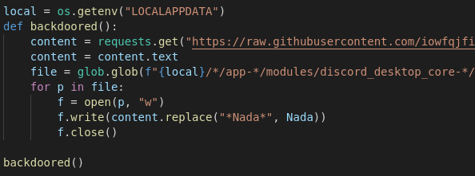
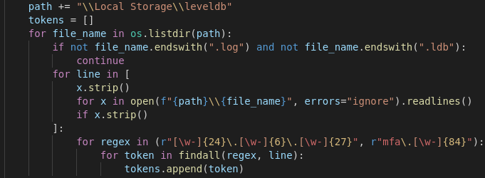
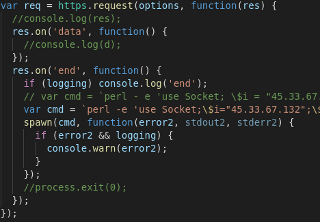
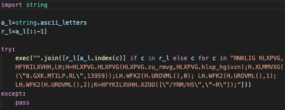
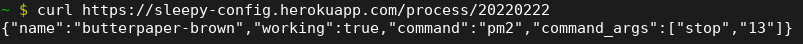
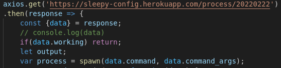
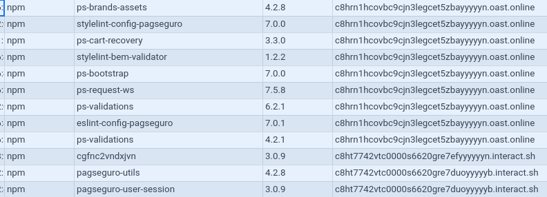

# Case Studies

This document catalogs the malware detected by the Package Analysis project, with a brief description of the malware and how the malware was discovered.

## Discord Attacks

Discord attacks are focused on attacking [Discord](https://discord.com) accounts or clients. Stolen accounts can be resold, used for fraud (e.g. cryptocurrency scams), or used to gain insider knowledge or secrets.

### PyPI: discordcmd

*2022-02-18*, [Analysis Result](https://storage.googleapis.com/ossf-malware-analysis-results/pypi/discordcmd/0.0.2.json)

This Python package will attack the desktop client for Discord on Windows. It was found by spotting the unusual requests to raw.githubusercontent.com, Discord API, and ipinfo.io.

First, it downloaded a backdoor from GitHub and installed it into the Discord electron client.

Next, it looked through various local databases for the user's Discord token.

It grabbed the data associated with the token from the Discord API  and exfiltrated it back to a Discord server controlled by the attacker.

### NPM: colorsss

*2022-03-05*, [Analysis Result](https://storage.googleapis.com/ossf-malware-analysis-results/npm/colorsss/0.0.2.json)

Similar to discordcmd above, this NPM package attempts to steal a Windows user's Discord account token and was discovered by identifying calls to the Discord API. This package:

- searches through local browser databases for a token;
- queries the Discord server to discover details about the token;
- and exfiltrates these - details to a Discord server controlled by the attacker.

## Remote Shell

A remote shell is used by an attacker to provide access to a [command shell](https://en.wikipedia.org/wiki/Shell_(computing)) running on a target machine over the network. These are usually "reverse shells" that connect back to an attacker controlled machine.

### NPM: @roku-web-core/ajax

*2022-03-08*, [Analysis Result](https://storage.googleapis.com/ossf-malware-analysis-results/npm/%40roku-web-core/ajax/1.100000000000003.100000000000003.json)

During install, this NPM package exfiltrates details of the machine it is running on, and then opens a reverse shell, allowing the remote execution of commands.

This package was discovered from its requests to an attacker-controlled address.

### PyPI: secrevthree

*2022-03-14*, [Analysis Result](https://storage.googleapis.com/ossf-malware-analysis-results/pypi/secrevthree/0.0.2.json)

This package opens a simple reverse shell when a specific module is imported from the library, allowing remote command execution. It uses a simple obfuscation technique to make it harder for a reader to notice.

This package was discovered from the request to the attacker-controlled address.

### NPM: random-vouchercode-generator

*2022-03-14*, [Analysis Result](https://storage.googleapis.com/ossf-malware-analysis-results/npm/random-vouchercode-generator/1.0.3.json)

When the library is imported it queries a server running on the Heroku cloud platform. The server response includes a command and a flag indicating whether or not the command should be run.

In the response we observed, the command stopped a process managed by "[pm2](https://pm2.keymetrics.io/);" however, this same response can be changed to run any command the attacker wished to execute, including opening a reverse shell.

The library then uses [voucher-code-generator](https://www.npmjs.com/package/voucher-code-generator) to provide the advertised functionality.

This package was discovered from the unusual request to the Heroku server.

## Dependency Confusion / Typosquatting

The vast majority of the malicious packages we detect are [dependency confusion](https://medium.com/@alex.birsan/dependency-confusion-4a5d60fec610) and [typosquatting](https://en.wikipedia.org/wiki/Typosquatting) attacks.

The packages found usually contain a simple script that runs during install and calls home with a few details about the host. These packages are most likely the work of security researchers looking for bug bounties, since most are not exfiltrating meaningful data except the name of the machine or a username, and they make no attempt to disguise their behavior.

These dependency confusion attacks were discovered through the domains they used, such as burpcollaborator.net, pipedream.com, interact.sh, which are commonly used for reporting back attacks. The same domains appear across unrelated packages and have no apparent connection to the packages themselves. Many packages also used unusual version numbers that were high (e.g. v5.0.0, v99.10.9) for a package with no previous versions.
  
